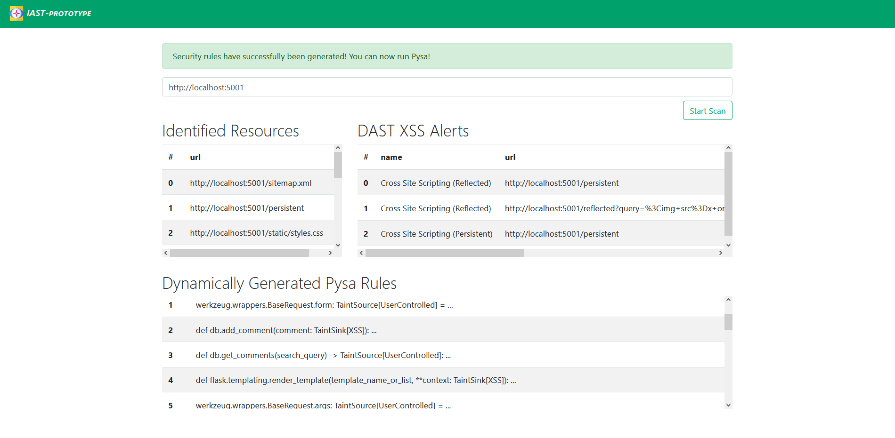

# IAST Prototype

A Python application security testing approach, 
implemented through the combination of 
automated penetration testing (DAST) and taint analysis (SAST).

---

## Components:
- FlaskXSS: Web application vulnerable to various XSS exploits, 
  based on the Python web application framework Flask
- Pysa (SAST): Open source taint analysis tool for Python applications 
- OWASP ZAP (DAST): Open source automated penetration testing software
- Jaeger: OpenTracing-compatible open source tracing backend
---

## Installation:
- ### IAST Prototype & FlaskXSS: 
  The development and execution of the IAST prototype and FlaskXSS 
  was performed within a Python 3.9 virtual environment. 
  
  First, the project's dependencies, defined in 
  the [requirements.txt](requirements.txt) file need to be installed:
  ```
    pip install -r requirements.txt
  ```
  
- ### OWASP ZAP:
  For the installation of OWASP ZAP, download and install the corresponding [ZAP installer file](https://www.zaproxy.org/download/).
  
  After completing the installation, the API key of your
  ZAP Desktop application (see screenshot below) must be copied to the `ZAP_Config.API_KEY`
  configuration class variable of the [app/config.py](app/config.py) file.
  
  
  
- ### Pysa:
  The IAST prototype was developed on a Windows 10 machine. Since Pysa only runs on UNIX based
  operating systems, the Windows Subsystem for Linux (WSL2) was installed according to 
  the Windows [installation guide](https://docs.microsoft.com/en-us/windows/wsl/install).
  Ubuntu 20.04 was chosen as Linux distribution. 
  
  Any Python version after Python 3.8 must be installed on the distribution in order to install Pysa. 
  The installation of Pysa on a virtual environment can be derived from the "Windows Subsystem 
  for Linux (WSL) Install" section of the [Pyre-Check documentation](https://pyre-check.org/docs/installation).
  
  After installation, Pysa must be initialised in the project directory of the web application that is to be
  analysed. Assuming that taint analysis should be carried out on a project that is located on Windows, 
  the initialisation is carried out as follows:
  
  ```bash 
  (venv) $ cd /mnt/c/path/to/your_project
  ``` 
  
  ```bash
  (venv) $ pyre init
  ```
  This will create a global [``.pyre_configuration``](FlaskXSS/.pyre_configuration) configuration file inside the root directory.
  Next, directories containing Pysa security rules must be specified within the [``.pyre_configuration``](FlaskXSS/.pyre_configuration) file.
  Security rules are composed of:
  - source, sink and rule definitions within one [``taint.config``](app/Pysa/taint.config) file
  - source, sink and sanitizer model declarations within any number of [``.pysa``](assets_thesis/pysa_security_rules/flask_sources_sinks.pysa) model files. 
    
  Accordingly, the value of the ``taint_models_path`` within the [``.pyre_configuration``](FlaskXSS/.pyre_configuration) file must be adjusted to
  point to the directories containing these files.
  
  Pysa has already been initialised in FlaskXSS. Within the bachelor thesis, three use cases of Pysa are demonstrated:
  1. Using only the pre-defined Pysa security rules copied from the [Pyre-Check project directory](https://github.com/facebook/pyre-check/tree/main/stubs/taint/core_privacy_security) (chapter 3.1.3).
  2. Using only the dynamically generated security rules of the IAST prototype (chapter 4.6, table 4).
  3. Using both pre-defined Pysa security rules and dynamically generated security rules (chapter 4.6, table 5).
  
  To reproduce the results of these cases, the following conditions must be met:
  
  1. 1. [The sources_sinks.pysa file](app/Pysa/sources_sinks.pysa) needs to be empty!
     2. The [``.pyre_configuration``](FlaskXSS/.pyre_configuration) file needs to be adjusted:
      ```
      "taint_models_path": [
        "/mnt/c/path/to/iast-prototype/app/Pysa",
        "/mnt/c/path/to/iast-prototype/assets_thesis/pysa_security_rules"
      ]
     ```
     3. Run Pysa
  2. 1. The [``.pyre_configuration``](FlaskXSS/.pyre_configuration) file needs to be adjusted:
     ```
      "taint_models_path": [
        "/mnt/c/path/to/iast-prototype/app/Pysa"
      ]
     ```
     2. Populate the [the sources_sinks.pysa file](app/Pysa/sources_sinks.pysa) by running the IAST prototype
     3. Run Pysa
  3. 1. The [``.pyre_configuration``](FlaskXSS/.pyre_configuration) file needs to be adjusted:
     ```
      "taint_models_path": [
        "/mnt/c/path/to/iast-prototype/app/Pysa",
        "/mnt/c/path/to/iast-prototype/assets_thesis/pysa_security_rules"
      ]
     ```
     2. Populate the [the sources_sinks.pysa file](app/Pysa/sources_sinks.pysa) by running the IAST prototype
     3. Run Pysa
- ### Jaeger:
  Make sure [Docker](https://www.docker.com/products/docker-desktop) is installed.

---

## Running the IAST Prototype:
At the beginning, all services of the IAST prototype architecture must be started. 
To do this, open three terminals for FlaskXSS, Jaeger and the IAST prototype. 
- FlaskXSS terminal: 
  ```
  (venv) C:\path\to\iast-prototype\FlaskXSS> python flaskxss.py
  ```
  This will deploy FlaskXSS to port ``5001``. Feel free to explore it prior to the execution of the IAST prototype. 

- Jaeger terminal:
  ```
  (venv) C:\path\to\iast-prototype> docker-compose up
  ```
  This will pull and execute the Jaeger all-in-one image within a Docker container. The Jaeger GUI listens to port ``16686``.
  
- IAST terminal:
  ```
  (venv) C:\path\to\iast-prototype> python iast-prototype.py
  ```
  This will deploy the IAST Prototype to port ``5000``.

- Furthermore, the ZAP Desktop application needs to be started.

Since repeated active scanning will lead to the storage of malicious data within the FlaskXSS 
database it is advised to delete the ``database.db`` file of
FlaskXSS before each execution of the IAST Prototype. 

Finally, navigate to the [IAST Prototype dashboard](http://localhost:5000). If everything went well,
the following view should be displayed:


Entering the [FlaskXSS URL](http://localhost:5001) and pressing the "Start Scan" button
will start the IAST process.
Information about the execution of the process can be tracked in the IAST terminal.
After the IAST process terminates, the results are displayed in the dashboard:



At this point, source and sink models have been declared by the IAST process, which can be
derived from the [sources_sinks.pysa](app/Pysa/sources_sinks.pysa) file. Finally, Pysa's
taint analysis can be executed:

```bash 
  (venv) $ cd /mnt/c/path/to/iast-prototype/FlaskXSS
``` 
```bash 
  (venv) $ pyre analyze --no-verify
``` 
This will output the results presented in chapter 4.6 in the following format:

